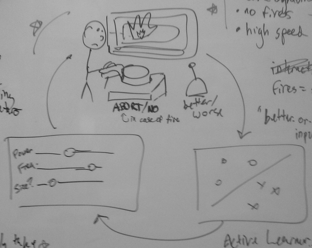

# Vision 1: Traversal of Creative Parameter Space with a Rapid Prototyping Bot

## Objective

In this project, we will program a machine to lead a human on an exploration of a configuration space in the pursuit of some human-judged creative goal.
This instantiation asks a laser cutter to produce multiple engravings, with a human providing guidance on when failure has occurred and the relative quality of consecutive configurations.

## Workflow

There are three main components in this system:

* A human working with a laser cutter.
The human watches the laser cutter perform engraving work and can provide one of two inputs:
the current engraving is better/worse than the last one, or an *abort* button that suggests that the workpiece has caught fire.
* An active learner.
This algorithm listens for human assessments of "better/worse" and failure cases to understand both the hard bounds of what are unacceptable examples and to develop a model of the best configuration.
It also produces requests for examples that should be tested next, presumably based on large areas of the configuration space that haven't been tested, or configurations that are likely the closest to optimal.
* Laser cutter control.
Configurations requested by the learner will be passed to the laser cutter control to influence the next round of engraving.

## Problem Framing

The objective of this problem is to produce an engraving that is:

1. of optimal darkness (not too dark, not too light)
2. of optimal speed (probably maximally fast)
3. doesn't cause fires

The third condition is a constraint that must be learned, and cannot be violated by the optimal point.
It places a constraint on the solution space.

## Unique aspects of this problem framing

* We are considering active learning in real time with a rapid prototyping machine
* In addition, human feedback is likely subjective and cannot be given as absolutes.
How can we pose a learning problem that will take "better" or "worse" as inputs?

## Notes as we look ahead at this project

### Implementation of Learner

* The cost function may not be a linear combination of the features (power, speed, and frequency of the laser).  Instead, we may need to include multiple features including powers and interactions.
* We may need to constrain the space of testable configurations to begin with for safety reasons, as we'll be testing this in the Invention Lab.

### Evaluation

We can test out how successful the human-machine loop is at optimizing the following objectives
* speed only
* color of engraving
* both speed and color of engraving

### Feasibility Assumptions

* It will only take around five seconds to see a stroke that is of the right depth of engraving.

## Roadmap

1. Implement an active learner that suggests configurations and accepts user judgments and guidance in a mock scenario not attached to a laser cutter
2. Spend some time with the laser cutter showing that:
    * some settings can light things on fire
    * some settings move faster than others
    * some settings are darker than others
3. Develop some way of passing these configurations through to control for the laser cutter

## Variants

* A similar system might be useful for generating ball-and-socket joints with maximum clearance, minimum wobble and minimum material.
* Finding settings for effective vector cutting through new materials
